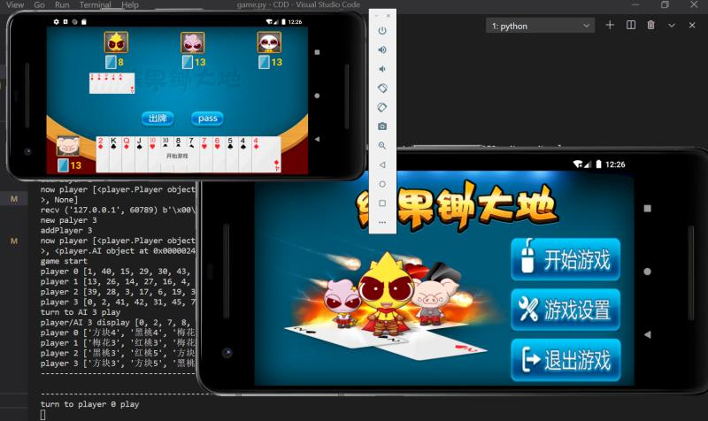
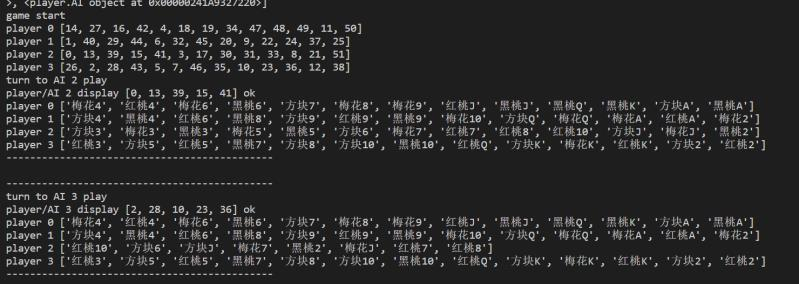
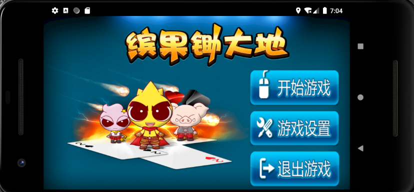
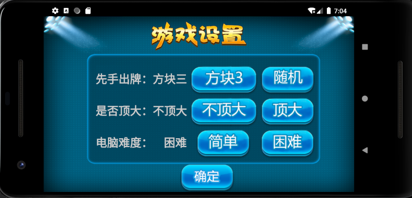
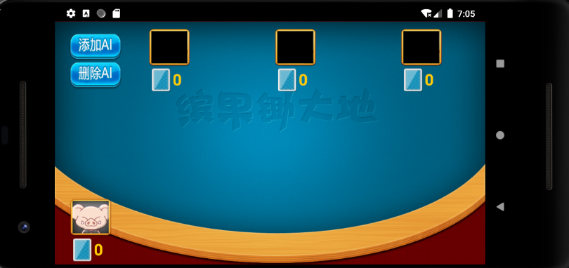
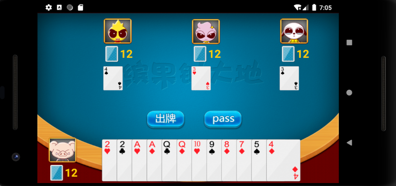

### 简介
锄大地实训的作品，单人开发，开发周期大概一周(实际平均每天只写了一个下午，167x)，使用了部分老师给的UI素材，代码全部从0开始纯手撸，总码量约两千。

### 使用
实现四人联机对战锄大地游戏，不足四人可以在游戏内添加AI。
game.py为服务器, python3 game.py即可部署运行。
MyApplication为Android Stduio的工程项目源码，编译后打开即为一个客户端(可多开)。
(注1：MainActivity.java中socket默认的IP为10.0.0.2，可以从模拟器连接至宿主机，可在云服运行server端并修改clinet连接的IP。)
(注2：服务器只有一个房间，逻辑上如果房间内全是AI则会清场)

### 技术栈

##### socket网络通信技术。
后端使用python下的socketserver。
前端使用java的socket标准库。

##### 多线程，线程锁，线程通信技术。
后端为每一个客户端分配一个socket线程，并且在socket线程访问游戏主进程的时候对主进程的函数加锁，防止内存脏写(主要是添加AI，删除AI，玩家加入和玩家退出这些功能是可以并发的)。
前端有一个安卓主进程(UI线程)和一个game子进程(逻辑处理与socket的进程)，game通过socket处理网络消息，内置player类处理逻辑，然后通过消息队列来和UI线程进行线程通信，修改UI界面，达到动画效果。

### 示例图片

### 经验&教训

这次实训文档和代码是分离的，我写代码，其他三位同学写的文档，并不交流。因为实训班内找不到共同开发软件，且可以达到1+1>1效果的熟人。

前端的架构确实不尽人意，有很多问题，代码也有些混乱，可能是因为对安卓还不够熟悉，功能都是增量式的添加。
另外后端自认为写的还不错，但是AI类来继承player类，而不是AI和player继承player-father类，有所不足，导致了只能用None表示空player，给错误处理和自动补全造成了一定的麻烦。

鲁棒性应该还算不错，基本BUG都修复了，且客户端中途退出，服务器端中途退出，都不会导致两端的程序闪退，且都会有提示。

java的socket标准库疑似有BUG，writeUTF函数如果写入空字符，编码不为\x00而为\xc0\x80，钻入标准库一看便知，不知道是BUG还是刻意为之。

安卓客户端的适配没怎么做，只能适配pixel 2机型(反正这个机型能演示就好x)。